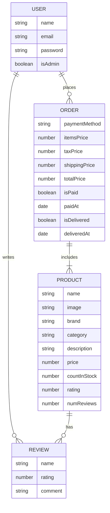
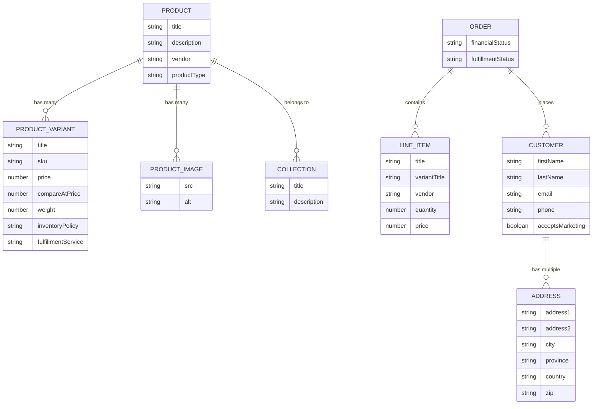

# Feature Enhancement Roadmap: Towards a Shopify-like Data Model

This document outlines a phased approach to enhance the ProShop backend, evolving its data model to be more aligned with Shopify's robust e-commerce structure. This roadmap will enable new features, improve scalability, and provide a better user experience.

## Current Data Model (as-is)

The existing data model is simple and effective for a basic e-commerce application. Here's a representation of the current schema:

## Target Data Model (to-be)

To support a more feature-rich, Shopify-like experience, we will evolve the data model to include concepts like product variants, collections, and a more detailed customer model.

## Phased Migration Plan

We will migrate the data model in phases to minimize disruption and deliver value incrementally.

### Phase 1: Product Variants and Options

This phase introduces product variants, allowing for different versions of the same product (e.g., size, color).

**User Stories:**

*   **As a** store owner, **I want to** add variants to my products, **so that I can** sell different versions of the same item.
    *   **Acceptance Criteria:**
        *   I can define options for a product (e.g., "Size", "Color").
        *   I can create variants for each combination of options (e.g., "Small, Red").
        *   Each variant can have its own SKU, price, and inventory level.
*   **As a** customer, **I want to** select a product variant, **so that I can** purchase the specific version I want.
    *   **Acceptance Criteria:**
        *   I can see the available options for a product on the product page.
        *   When I select an option, the price and image update to reflect the chosen variant.
        *   I can add the selected variant to my cart.

### Phase 2: Enhanced Product & Customer Management

This phase focuses on improving how products are organized and how customer information is managed.

**User Stories:**

*   **As a** store owner, **I want to** organize my products into collections, **so that I can** make it easier for customers to browse.
    *   **Acceptance Criteria:**
        *   I can create, edit, and delete collections.
        *   I can add products to one or more collections.
        *   Collections can be displayed on the storefront.
*   **As a** store owner, **I want to** have a more detailed customer profile, **so that I can** better understand and market to my customers.
    *   **Acceptance Criteria:**
        *   Customer profiles include first name, last name, email, phone number, and addresses.
        *   I can see a customer's order history.
        *   I can see if a customer has opted-in to marketing.

### Phase 3: Advanced Order and Fulfillment

This phase introduces more sophisticated order management and fulfillment capabilities.

**User Stories:**

*   **As a** store owner, **I want to** manage inventory more effectively, **so that I can** avoid overselling and track stock levels accurately.
    *   **Acceptance Criteria:**
        *   Inventory is tracked at the variant level.
        *   I can set an inventory policy (e.g., "deny" or "continue" selling when out of stock).
        *   I can see a history of inventory changes for each variant.
*   **As a** store owner, **I want to** manage order fulfillment, **so that I can** track which items have been shipped and which are pending.
    *   **Acceptance Criteria:**
        *   Orders have a fulfillment status (e.g., "fulfilled", "partially fulfilled", "unfulfilled").
        *   I can mark line items as fulfilled and add tracking information.
        *   Customers are notified when their order is shipped.

### Phase 4: Search and Discovery

This phase will introduce a dedicated search and discovery service to provide a better customer experience.

**User Stories:**

*   **As a** customer, **I want to** search for products, **so that I can** quickly find what I'm looking for.
    *   **Acceptance Criteria:**
        *   I can search by product name, description, vendor, and product type.
        *   Search results are relevant and displayed quickly.
        *   I can filter and sort search results.
*   **As a** store owner, **I want to** see what customers are searching for, **so that I can** understand demand and optimize my product catalog.
    *   **Acceptance Criteria:**
        *   I can see a report of the most popular search terms.
        *   I can see which search terms produce no results.
        *   I can use this information to create new products or collections.
